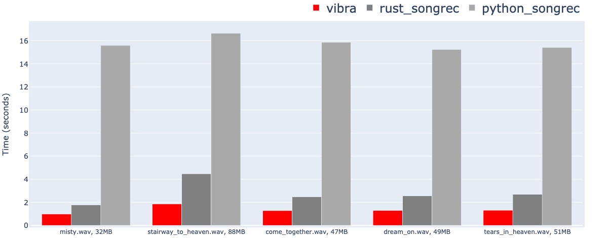

# 🎵 vibra


### What is vibra?
* vibra is a C++ music file recognition tool that uses an unofficial Shazam API.
* vibra analyzes music files and returns fingerprint data. It searches the Shazam database to identify the song.
* The Shazam algorithm is based on:
    * [An Industrial-Strength Audio Search Algorithm](https://www.ee.columbia.edu/~dpwe/papers/Wang03-shazam.pdf)
    * [How does Shazam work](https://www.cameronmacleod.com/blog/how-does-shazam-work)
* I referenced the Rust implementation of the Shazam client code from [SongRec](https://github.com/marin-m/SongRec/tree/master).
* I created this project for embedded devices such as Raspberry Pi or Jetson Nano, which are challenging to set up with Python or Rust environments.


<figcaption align = "center">benchmark on RPi4, lower is better</figcaption>
<br>

* I compared the performance of vibra with the [SongRec](https://github.com/marin-m/SongRec/tree/master) rust and python version on the Raspberry Pi 4.
* vibra is about 2 times faster than the SongRec!

### Run vibra

#### Requirements

* vibra uses CMake for building. You need to install [CMake](https://cmake.org/) to build vibra.
* vibra utilizes C++11 features.
* vibra depends on the following libraries:
    * [libcurl](https://curl.se/libcurl/): To send HTTP requests to the Shazam API.
    * [libfftw3](http://www.fftw.org/): To calculate the Fast Fourier Transform.

#### Build
* You can build vibra with CMake using the following commands:
    * `mkdir build && cd build`
    * `cmake ..`
    * `make`

* If you want to specify the paths for libraries or include files, you can use the commands below:
    * `cmake -DINCLUDE_PATH=/path/to/include`
    * `cmake -DLIBRARY_PATH=/path/to/lib`
    

#### Run
* Use `./vibra help` to see the help message.

```
Usage: vibra <action> <param>

* Actions:
	fingerprint-from-raw-pcm <audio_chunk_seconds>
		Generate fingerprint from raw PCM (s16le, mono, 16kHz) via stdin.

	fingerprint-from-wav-file <wav_file_path>
		Generate fingerprint from wav file

	recognize-song-from-raw-pcm <audio_chunk_seconds>
		Recognize song from raw PCM (s16le, mono, 16kHz) via stdin.

	recognize-song-from-wav-file <wav_file_path>
		Recognize song from wav file
```

#### Examples
##### - recognizing song from wav file
```bash
$ ./vibra recognize-song-by-file "stairway_to_heaven.wav" > result.json
$ jq .track.title result.json
"Stairway To Heaven"
$ jq .track.subtitle result.json
"Led Zeppelin"
$ jq .track.share.href result.json
"https://www.shazam.com/track/5933917/stairway-to-heaven"
```

##### - recognizing song from microphone
* You can use [sox](http://sox.sourceforge.net/) or [ffmpeg](https://ffmpeg.org/) to print raw PCM data from **microphone**.

```bash
$ sox -d -t raw -b 16 -e signed-integer -r 16000 -c 1 - 2>/dev/null | ./vibra recognize-song-from-raw-pcm 5 > result.json
$ jq .track.title result.json
"Bound 2"
$ jq .track.subtitle result.json
"Kanye West"
$ jq .track.sections[1].text result.json
[
  "B-B-B-Bound to fall in love",
  "Bound to fall in love",
  "(Uh-huh, honey)",
  "",
  "All them other niggas lame, and you know it now",
  "When a real nigga hold you down, you supposed to drown",
  "",
  "Bound (bound) to fall in love",
  "B-B-B-Bound (bound) to fall in love",
  "(Uh-huh, honey)",
  "",
  "What you doing in the club on a Thursday?",
  "She say she only here for her girl birthday",
  "They ordered champagne but still look thirsty",
  "Rock Forever 21 but just turned 30",
  "I know I got a bad reputation",
  "Walk-around-always-mad reputation",
...
```

### Build for Web Assembly
* vibra supports web assembly module to run shazam on a web browser
* To build vibra to wasm, you need to build [fftw3](http://www.fftw.org/) with Emscripten.
```
wget http://www.fftw.org/fftw-3.3.10.tar.gz
tar -cvf ./fftw-3.3.10.tar.gz
cd fftw-3.3.10
emconfigure ./configure --prefix="/path/to/fft"
emmake make
```


### License
* vibra is licensed under the GPLv3 license. See [LICENSE](LICENSE) for more details.
