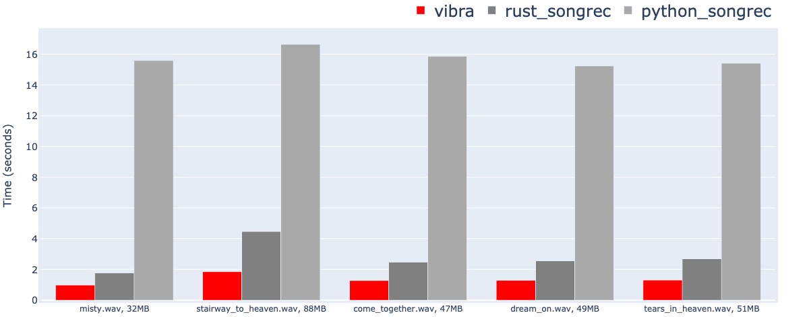

<p align="center">
    
    <br>
    
</p>

<span align="center">

# vibra

</span>


<p align="center">
    
    
</p>

### What is vibra?
* vibra is a C++ music file recognition tool that uses an unofficial Shazam API.
* vibra analyzes music files and returns fingerprint data. It searches the Shazam database to identify the song.
* The Shazam algorithm is based on:
    * [An Industrial-Strength Audio Search Algorithm](https://www.ee.columbia.edu/~dpwe/papers/Wang03-shazam.pdf)
    * [How does Shazam work](https://www.cameronmacleod.com/blog/how-does-shazam-work)
* I referenced the Rust implementation of the Shazam client code from [SongRec](https://github.com/marin-m/SongRec/tree/master).
* I created this project for embedded devices such as Raspberry Pi or Jetson Nano, which are challenging to set up with Python or Rust environments.
* You can see the sample shazam result json file in [here](https://gist.github.com/BayernMuller/b92fd43eef4471b7016009196e62e4d2)

### Compatibility table

<div align="center">

| Platform         |     Architecture | Build Status     |
|------------------|------------------|------------------|
| [WebAssembly](wasm/readme.md) | -                | ✅                |
| Linux            | x86_64           | ✅                |
| Linux            | ARM64            | ✅                |
| Windows          | x86_64           | ✅                |
| macOS            | x86_64           | ✅                |
| macOS            | ARM64            | ✅                |
| Raspberry Pi 4   | ARMv8-A          | ✅                |
| Raspberry Pi Zero| ARMv6            | ✅                |

</div>

### Build vibra

#### Requirements

* vibra uses CMake for building. You need to install [CMake](https://cmake.org/) to build vibra.
* vibra utilizes C++11 features.
* vibra depends on the following libraries:
    * [libcurl](https://curl.se/libcurl/): To send HTTP requests to the Shazam API.
    * [libfftw3](http://www.fftw.org/): To calculate the Fast Fourier Transform.

#### Build
* Clone repository **recursively** to include submodules.
    * `git clone --recursive https://github.com/bayernmuller/vibra.git`

* Run the following commands to build vibra:
    * `mkdir build && cd build`
    * `cmake ..`
    * `make`

#### Usage
* Use `vibra -h` to see the help message.

```
vibra {COMMAND} [OPTIONS]

Options:

  Commands:
      -F, --fingerprint                     Generate a fingerprint
      -R, --recognize                       Recognize a song
      -h, --help                            Display this help menu
  Sources:
      File sources:
          -w, --wav                             WAV file
      Raw PCM sources:
          -s, --seconds                         Chunk seconds
          -r, --rate                            Sample rate
          -c, --channels                        Channels
          -b, --bits                            Bits per sample
```

##### - recognizing song from wav file
```bash
$ vibra --recognize --wav sample.wav > result.json
$ jq .track.title result.json
"Stairway To Heaven"
$ jq .track.subtitle result.json
"Led Zeppelin"
$ jq .track.share.href result.json
"https://www.shazam.com/track/5933917/stairway-to-heaven"
```

##### - recognizing song from microphone
* You can use [sox](http://sox.sourceforge.net/) or [ffmpeg](https://ffmpeg.org/) to print raw PCM data from **microphone**.

```bash
$ sox -d -t raw -b 24 -e signed-integer -r 44100 -c 1 - 2>/dev/null
  | vibra --recognize --seconds 5 --rate 44100 --channels 1 --bits 24 > result.json

$ jq .track.title result.json
"Bound 2"
$ jq .track.subtitle result.json
"Kanye West"
$ jq .track.sections[1].text result.json
[
  "B-B-B-Bound to fall in love",
  "Bound to fall in love",
  "(Uh-huh, honey)",
  "",
  "All them other niggas lame, and you know it now",
...
```

### Performance comparison
<p align="center">
    <br/>
    lower is better
</p>

* I compared the performance of vibra with the [SongRec](https://github.com/marin-m/SongRec/tree/master) rust and python version on the Raspberry Pi 4.
* vibra is about 2 times faster than the SongRec!

### WebAssembly Version Support
* Please read [wasm/readme.md](wasm/readme.md) to build vibra webassembly version.

### Demo Video
* Real time music tracker and lighting solution "Mooding", which uses vibra.
* Click to view!

[](https://www.youtube.com/watch?v=f88EUEIohI4)

### License
* vibra is licensed under the GPLv3 license. See [LICENSE](LICENSE) for more details.